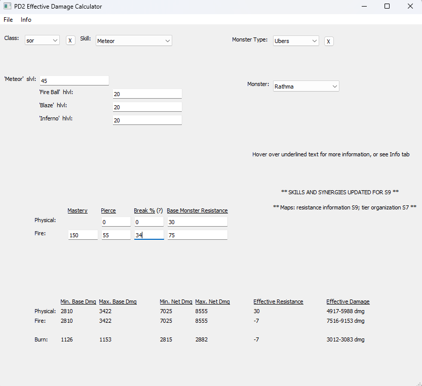

# PD2 Effective Damage Calculator

[Download ZIP](https://github.com/Doudline/pd2-damage-calculator/raw/main/releases/pd2_effective_dmg.zip)

**Updated for Season 10 Beta patch 1**

This utility is designed for the popular Diablo 2 Lord of Destruction mod "Project Diablo 2". It addresses the tedium of pulling out a pen, paper and calculator to determine whether to prioritize skill damage or -% enemy resistance on your equipment.

To use, click on the download link, extract the folder and double-click on main.exe (Windows Defender/your anti-virus will give you an alert).

**Features:**
1. Select a skill, input its level, and its synergies' levels.
2. Input your mastery, pierce, and break percentages.
3. Choose a monster from the base game or PD2 content to automatically retrieve its resistances.
4. Automatically calculate the effective damage applied to the monster based on standard damage formulas for skills, taking into account monster resistances.

Alternatively, you can manually input skill damage and monster resistance.

**Please Note:**
1. Skill damage and resistances are fetched from text files. While text files are *almost always* correct they are not *necessarily* so, because they are not sourced from the game code.
2. Only damaging "spell" skills, i.e., those that do not rely primarily on weapon damage, have been implemented. Some skills, such as various Amazon arrows, are included for calculating their ADDED ELEMENTAL DAMAGE ONLY.
3. Certain monsters, like most superuniques, are omitted.

I am a beginner programmer; this is my first "serious" project intended for public use. Therefore, please expect bugs and unintended crashes.

Feel free to contact me here on GitHub or on Discord for questions, bug reports, or feature requests [no promises!].
[Message Me on Discord](https://discordapp.com/users/Doudline%234864)